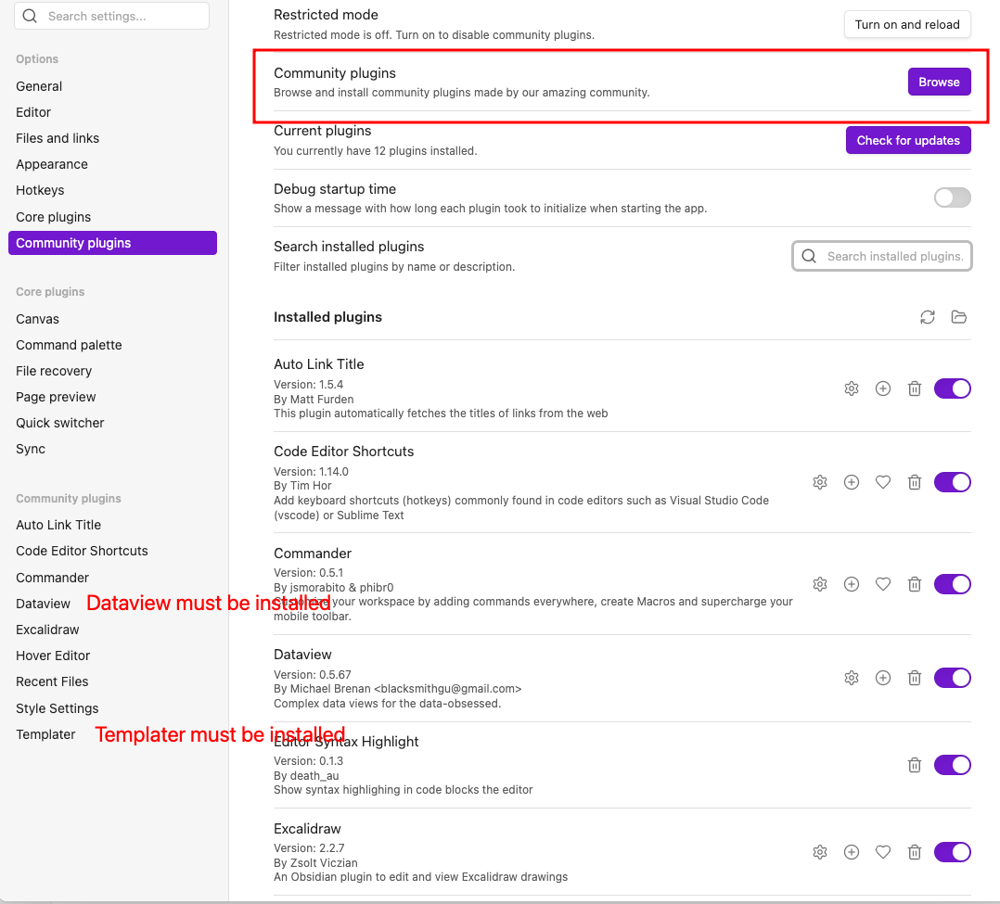
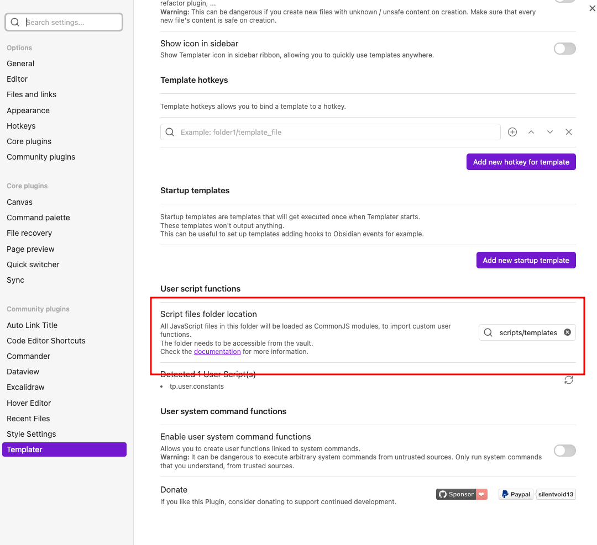

Yet Another Zettelkasten template, a tool crafted to simplify your note organization through the Zettelkasten method. Explore the [[00_Home MOC]] for detailed insights.

# Setup Guide

## Default Settings

To kickstart your journey, enable default plugins located at `.obsidian` for a seamless experience.

⚠️ **Warning:**

> If you are not subscribed to Obsidian Sync (a core plugin), please follow the instructions and install the plugins listed below.

- [Dataview](https://obsidian.md/plugins?search=dataview)
- [Templater](https://obsidian.md/plugins?id=templater-obsidian)
- [Commander](https://obsidian.md/plugins?search=Commander) - With this plugin, if you’re using a mobile device, you can swipe down from the top to display the "Create from template" option

Open obsidian `Settings > Community plugins > Browse`. Enable community plugins if its turnoff (this is the default behavior)

### Setup Templater

> “You might want to check out the scripts (under scripts folder) that only contain constants for formatting dates and other similar purposes. '/scripts/' ”

- Change the **Template folder location** to "templates" and **Script files folder location** to "scripts/templates"

## Customization

Make your Zettelkasten uniquely yours by personalizing templates found in `/templates/`. Tailor the system to match your distinctive style and preferences.

## Templates

Utilize the convenient shortcut `ctrl + N` on Windows or `cmd + N` on Mac to create a new note and choose from a variety of templates.

To learn more about using templates, please refer to the [Templater](https://silentvoid13.github.io/Templater/) documentation

> `/templates/macros/z_init.md` - This file is used in each template to insert metadata such as links, creation date, ordinal numbers, and tags.

> `/templates/macros/z_habit.md` - This file is used in each journal or daily template, recommended for tracking frequent habits or tasks you usually do, especially those that may change unexpectedly

## Display

Most of the MOC files utilize the Dataview plugin. To customize them, please refer to the [Dataview](https://blacksmithgu.github.io/obsidian-dataview/) documentation.

## Theme
You can customize the appearance of your Obsidian notes by using the [Style Settings](https://obsidian.md/plugins?search=Style%20settings) plugin or exploring other style settings options

## Journaling

For a structured daily journal, update templates under `/templates/macros/z_daily_task_start.md` and `/templates/macros/z_daily_task_end.md`.

# Explore More

## Related Resources

- [[Zettelkasten study from Youtube]]
- [[Digital Zettelkasten- Principles, Methods, & Examples]]
- [Linking Your Thinking](https://www.linkingyourthinking.com/)

Feel free to suggest improvements. Enjoy a seamless and efficient note-taking journey!